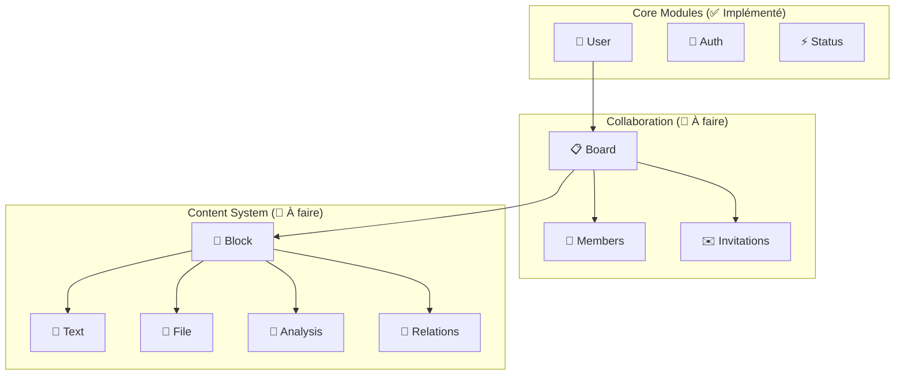

# Analyse complète du projet Zukii

## 🎯 **Vision et contexte métier**

### **Qu'est-ce que Zukii ?**
Zukii est une **plateforme collaborative d'analyse de données CSV avec intelligence artificielle**. L'application permet aux utilisateurs de :
- Télécharger et analyser des fichiers CSV
- Collaborer en temps réel sur l'analyse de données
- Générer automatiquement des visualisations et analyses via IA
- Partager des insights dans des espaces de travail dédiés

### **Contexte technique**
- **Projet de diplôme expert** en développement logiciel
- **Architecture microservice-ready** avec NestJS
- **Stack moderne** : TypeScript, PostgreSQL, Docker
- **Sécurité first** : JWT, bcrypt, validation stricte
- **Prêt pour la production** : tests, CI/CD, documentation

---

## 🏗️ **Architecture actuelle vs. Vision complète**

### **État actuel (implémenté) ✅**

#### **Modules fonctionnels :**
1. **Auth** : Authentification JWT complète
2. **Users** : Gestion utilisateurs avec profils public/privé  
3. **Status** : Système d'états centralisé avec enums TypeScript

#### **Infrastructure :**
- Base de données PostgreSQL avec TypeORM
- Docker Compose pour développement
- Tests unitaires avec Jest (27 tests)
- CI/CD pipeline avec GitHub Actions
- Documentation Swagger complète
- Sécurité par défaut (JWT Guard global)

### **Vision complète (à implémenter) 🚧**



---

## 🔍 **Analyse approfondie du code existant**

### **1. Architecture modulaire NestJS**

```typescript
// Structure modulaire parfaitement respectée
src/modules/[entity]/
├── entities/[entity].entity.ts    # Modèle de données TypeORM
├── dto/                          # Validation et sérialisation
│   ├── create-[entity].dto.ts    # Données entrantes
│   ├── update-[entity].dto.ts    # Mise à jour partielle
│   └── [entity]-response.dto.ts  # Données de sortie
├── [entity].controller.ts        # Endpoints REST + Swagger
├── [entity].service.ts           # Logique métier
├── [entity].service.spec.ts      # Tests unitaires
├── [entity].controller.spec.ts   # Tests endpoints
└── [entity].module.ts           # Configuration NestJS
```

### **2. Patterns de conception appliqués**

#### **Repository Pattern** 
```typescript
@Injectable()
export class UsersService {
  constructor(
    @InjectRepository(User) private readonly userRepository: Repository<User>,
    private readonly statusService: StatusService, // Injection de dépendances
  ) {}
}
```

#### **DTO Pattern avec validation**
```typescript
export class CreateUserDto {
  @IsEmail() @ApiProperty() email: string;
  @MinLength(8) @ApiProperty() password: string;
  @IsOptional() @ApiProperty() displayName?: string;
}
```

#### **Security by Design**
```typescript
// Protection globale avec exceptions explicites
@Injectable()
export class JwtAuthGuard extends AuthGuard('jwt') {
  canActivate(context: ExecutionContext) {
    const isPublic = this.reflector.getAllAndOverride<boolean>(IS_PUBLIC_KEY, [
      context.getHandler(),
      context.getClass(),
    ]);
    if (isPublic) return true; // Routes publiques explicites
    return super.canActivate(context);
  }
}
```

### **3. Gestion des données de référence**

#### **Approche hybride intelligente**
```typescript
// Enums TypeScript pour type safety
export enum UserStatus {
  ACTIVE = 'user-active',
  INACTIVE = 'user-inactive',
}

// Base de données pour persistance
@Entity('statuses')
export class Status {
  @PrimaryColumn() id: string; // IDs fixes, pas d'UUID auto
  @Column() category: string;
  @Column() name: string;
}

// Seeding contrôlé pour développement
export class StatusSeeder {
  static async run(dataSource: DataSource): Promise<void> {
    const statusesToSeed = ALL_STATUSES.map((statusId) => {
      const [category, name] = statusId.split('-');
      return { id: statusId, category, name, isActive: true };
    });
  }
}
```

**Avantages de cette approche :**
- Type safety à la compilation
- Relations stables en base
- Facilité de testing
- IDs parlants et prévisibles

### **4. Sécurité robuste**

#### **Authentification**
```typescript
// Hachage sécurisé
const saltRounds = 12; // Coût élevé pour sécurité
const passwordHash = await bcrypt.hash(password, saltRounds);

// JWT avec expiration
signOptions: { expiresIn: '24h' }
```

#### **Autorisation granulaire**
```typescript
// Séparation profil public/privé
@Get('me') // Profil complet pour soi-même
async getMe(@Request() req: { user: JwtUser })

@Get(':id/public') // Données limitées pour les autres
async getPublicProfile(@Param('id') id: string): Promise<PublicUserDto>
```

#### **Validation stricte**
```typescript
// Validation automatique sur tous les endpoints
@UsePipes(new ValidationPipe({ 
  transform: true,    // Transformation automatique
  whitelist: true,    // Suppression champs non autorisés
  forbidNonWhitelisted: true 
}))
```

---

## 📊 **Modèle de données complet**

### **Entités actuelles (implémentées)**

#### **User** 
```sql
users (
  id UUID PRIMARY KEY,
  email VARCHAR(255) UNIQUE NOT NULL,
  password_hash VARCHAR(255) NOT NULL,
  display_name VARCHAR(100) NOT NULL,
  status_id UUID REFERENCES statuses(id),
  created_at, updated_at, deleted_at -- Soft delete
)
```

#### **Status**
```sql
statuses (
  id VARCHAR PRIMARY KEY,  -- IDs fixes : 'user-active', 'board-archived'
  category VARCHAR(50),    -- 'user', 'board', 'block', 'invitation'
  name VARCHAR(50),        -- 'active', 'inactive', 'archived'
  is_active BOOLEAN DEFAULT true
)
```

### **Entités à implémenter (roadmap)**

#### **Système de collaboration**
```sql
-- Espaces de travail
boards (
  id UUID PRIMARY KEY,
  title VARCHAR(200) NOT NULL,
  description TEXT,
  owner_id UUID REFERENCES users(id),
  status_id VARCHAR REFERENCES statuses(id),
  background_color VARCHAR(7) DEFAULT '#FFFFFF'
)

-- Membres avec permissions granulaires
board_members (
  id UUID PRIMARY KEY,
  board_id UUID REFERENCES boards(id),
  user_id UUID REFERENCES users(id),
  permission_level ENUM('view', 'edit', 'admin'),
  UNIQUE(user_id, board_id) WHERE deleted_at IS NULL
)

-- Invitations temporaires
invitations (
  id UUID PRIMARY KEY,
  board_id UUID REFERENCES boards(id),
  email VARCHAR(255),
  permission_level ENUM('view', 'edit', 'admin'),
  invitation_token VARCHAR(128) UNIQUE,
  expires_at TIMESTAMP,
  invited_by UUID REFERENCES users(id)
)
```

#### **Système de contenu avancé**
```sql
-- Blocks : conteneurs génériques positionnés
blocks (
  id UUID PRIMARY KEY,
  board_id UUID REFERENCES boards(id),
  created_by UUID REFERENCES users(id),
  block_type ENUM('text', 'file', 'analysis'),
  title VARCHAR(200),
  position_x INTEGER CHECK (position_x >= 0),
  position_y INTEGER CHECK (position_y >= 0),
  width INTEGER DEFAULT 300,
  height INTEGER DEFAULT 200,
  z_index INTEGER DEFAULT 0,
  content_id UUID, -- Référence générique vers le contenu spécialisé
  status_id VARCHAR REFERENCES statuses(id)
)

-- Contenu textuel (Markdown/HTML)
text_contents (
  id UUID PRIMARY KEY,
  content TEXT NOT NULL,
  format_type ENUM('plain', 'markdown', 'html') DEFAULT 'plain'
)

-- Métadonnées fichiers avec S3
file_contents (
  id UUID PRIMARY KEY,
  file_name VARCHAR(255),
  s3_key VARCHAR(500),
  s3_bucket VARCHAR(100),
  file_size BIGINT,
  mime_type VARCHAR(100),
  uploaded_by UUID REFERENCES users(id),
  upload_status ENUM('uploading', 'completed', 'failed')
)

-- Résultats d'analyses IA
analysis_contents (
  id UUID PRIMARY KEY,
  analysis_type VARCHAR(100), -- 'plotly_chart', 'statistical_summary'
  result_data JSONB,         -- Graphiques Plotly, données de sortie IA
  source_file_id UUID REFERENCES file_contents(id),
  execution_status ENUM('pending', 'running', 'completed', 'failed'),
  execution_time INTEGER,
  error_message TEXT
)

-- Relations entre blocks (traçabilité)
block_relations (
  id UUID PRIMARY KEY,
  source_block_id UUID REFERENCES blocks(id),
  target_block_id UUID REFERENCES blocks(id),
  relation_type ENUM('generated_from', 'references', 'comment_on', 'derived_from'),
  metadata JSONB,
  created_by UUID REFERENCES users(id)
)
```

---

## 🛠️ **Points d'attention pour le développement**

### **1. Conventions et standards**

#### **Principes SOLID appliqués**
- **SRP** : Une responsabilité par service/controller
- **OCP** : Extension via modules et héritage (BaseEntity)
- **LSP** : Interfaces respectées (Repository pattern)
- **ISP** : DTOs spécialisés par cas d'usage
- **DIP** : Injection de dépendances obligatoire (jamais de `new`)

#### **Patterns de nommage**
```typescript
// Entités : PascalCase
export class User extends BaseEntity

// Services : [Entity]Service
export class UsersService

// DTOs : [Action][Entity]Dto
export class CreateUserDto
export class UserResponseDto

// Controllers : [Entity]Controller
export class UsersController

// Modules : [Entity]Module
export class UsersModule
```

### **2. Testing strategy**

#### **Structure des tests**
```typescript
describe('UsersService', () => {
  let service: UsersService;
  let repository: jest.Mocked<Repository<User>>;
  
  beforeEach(async () => {
    const module = await Test.createTestingModule({
      providers: [
        UsersService,
        { provide: getRepositoryToken(User), useValue: mockRepository },
        { provide: StatusService, useValue: mockStatusService },
      ],
    }).compile();
  });
});
```

#### **Couverture actuelle**
- **27 tests unitaires** passants
- **Mocks appropriés** pour isolation
- **Validation des erreurs** et cas limites
- **Tests de sécurité** (autorisations)

### **3. Gestion des erreurs**

#### **Exceptions métier appropriées**
```typescript
// Conflits de données
throw new ConflictException('Un utilisateur avec cet email existe déjà');

// Ressources non trouvées
throw new NotFoundException('Utilisateur non trouvé');

// Autorisations insuffisantes
throw new ForbiddenException('Accès refusé à cette ressource');
```

#### **Logging structuré**
```typescript
private readonly logger = new Logger(UsersService.name);

this.logger.log(`Utilisateur créé avec succès: ${user.email} (ID: ${user.id})`);
this.logger.error(`Erreur lors de la création: ${error.message}`, error.stack);
```

---

## 🚀 **Roadmap technique prioritaire**

### **Phase 1 : Collaboration (Critique)**
1. **BoardModule** : Espaces de travail
2. **BoardMemberModule** : Permissions granulaires
3. **InvitationModule** : Système d'invitations

### **Phase 2 : Contenu de base**
1. **BlockModule** : Conteneurs positionnés
2. **TextContentModule** : Contenu textuel simple

### **Phase 3 : Fichiers et analyses IA**
1. **FileContentModule** : Upload S3, métadonnées
2. **AnalysisTemplateModule** : Templates système préconfigurés pour IA
3. **AnalysisContentModule** : Intégration microservice Python + OpenAI
4. **BlockRelationModule** : Traçabilité

### **Phase 4 : Features avancées**
1. **Notifications** en temps réel (WebSockets)
2. **Versionning** des contenus
3. **API Analytics** et métriques

---

## 🔧 **Setup de développement**

### **Commandes essentielles**
```bash
# Installation et démarrage
npm install
docker compose up -d db
# Auto-seeding intelligent - aucune action manuelle requise
npm run start:dev

# Tests et qualité
npm run test           # 27 tests unitaires
npm run lint          # ESLint + Prettier
npm run test:cov      # Couverture de code

# Base de données
# Auto-seeding intelligent - reset automatique si table vide
docker compose --profile tools up -d adminer  # Interface DB
```

### **URLs importantes**
- **API** : http://localhost:3000
- **Swagger** : http://localhost:3000/api
- **Adminer** : http://localhost:8080

---

## 💡 **Points clés pour un nouveau développeur**

### **Ce qui est excellent ✅**
1. **Architecture propre** : Modules bien séparés, injection dépendances
2. **Sécurité robuste** : JWT, bcrypt, validation stricte
3. **Tests complets** : 27 tests unitaires, mocks appropriés
4. **Documentation** : Swagger complet, README détaillé
5. **Type safety** : TypeScript strict, DTOs validés
6. **Prêt production** : Docker, CI/CD, logging

### **Défis à anticiper ⚠️**
1. **Complexité croissante** : Relations multiples (Block ↔ Content)
2. **Performances** : Queries spatiales (position blocks), JSONB
3. **Concurrence** : Édition collaborative temps réel
4. **Fichiers** : Gestion S3, quotas, sécurité uploads
5. **IA Integration** : Gestion des APIs externes, timeouts

### **Où commencer ? 🎯**
1. **Lire ce document** et la documentation existante
2. **Lancer les tests** : `npm run test` pour valider l'environnement
3. **Explorer Swagger** : http://localhost:3000/api
4. **Implémenter BoardModule** : Premier module critique

---

## 🎖️ **Philosophie du projet**

**Zukii incarne l'excellence en développement moderne :**
- **Sécurité first** : Aucun compromis sur la sécurité
- **Type safety** : TypeScript strict, validation complète  
- **Tests obligatoires** : TDD, couverture élevée
- **Architecture future-proof** : Prêt pour microservices
- **Documentation vivante** : Code auto-documenté

**Ce projet est un excellent exemple d'application NestJS professionnelle, prête pour un environnement de production enterprise.**

---

*Document d'analyse technique - Version 1.0*  
*Projet Zukii - API collaborative d'analyse de données* 