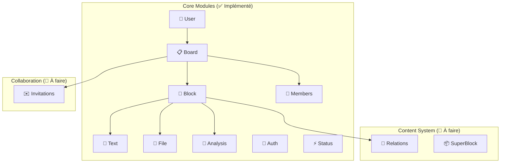

# Analyse complète du projet Zukii

## 🎯 **Vision et contexte métier**

### **Qu'est-ce que Zukii ?**
Zukii est une **plateforme collaborative d'analyse de données CSV avec intelligence artificielle**. L'application permet aux utilisateurs de :
- Télécharger et analyser des fichiers CSV dans des espaces de travail (boards)
- Collaborer de manière asynchrone sur l'analyse de données via une interface structurée
- Générer automatiquement des visualisations et analyses via IA (microservice Python)
- Partager des insights avec permissions granulaires (view/edit/admin)
- Organiser le contenu en blocks structurés (notes, fichiers, analyses)

### **🎓 Contexte Diplôme RNCP 39583 Expert Logiciel**
**Projet fil rouge démonstratif** pour certification professionnelle :

#### **Compétences démontrées :**
- **Architecture logicielle** : NestJS modulaire, design patterns (Repository, DTO, DI)
- **Sécurité applicative** : JWT global, bcrypt, validation stricte, protection OWASP
- **Qualité logicielle** : 92/92 tests unitaires, ESLint strict, TypeScript
- **Base de données** : PostgreSQL, TypeORM, relations complexes, soft delete
- **API REST** : Documentation Swagger, codes HTTP appropriés
- **DevOps** : Docker, environnements multiples, CI/CD

#### **MVP Objectif (Diplôme) :**
Interface web démontrant la collaboration sur analyse CSV :
1. **Authentification sécurisée** (login/register)
2. **Gestion boards collaboratifs** (création, partage, permissions)
3. **Interface structurée** (organisation blocks par colonnes)
4. **Upload/analyse CSV** (fichiers → visualisations IA)
5. **Collaboration asynchrone** (permissions granulaires, historique)

### **👥 Étude de Marché et Personas**

#### **🎯 Problématique Métier**
**Contexte :** Les PME et équipes projets génèrent énormément de données CSV (exports CRM, analytics, enquêtes) mais manquent d'outils accessibles pour l'analyse collaborative.

**Gap identifié :**
- **Power BI/Tableau** → Trop chers pour PME (50€+/mois/user)
- **Excel/Google Sheets** → Limités sur gros datasets, pas d'IA
- **Jupyter/R** → Barrière technique élevée pour non-développeurs
- **Slack/Email** → Analyses perdues, pas de centralisation

**Solution Zukii :** Plateforme accessible alliant simplicité d'usage et puissance IA.

#### **👤 Persona Principal : Data Analyst PME**
```
Sarah Chen, 28 ans - Analyste données chez Cabinet Conseil (50 pers.)

Pain Points :
├── Excel insuffisant pour datasets >100k lignes
├── Budget limité (pas Power BI à 50€/mois)
├── Collaboration difficile avec équipes non-techniques
├── Analyses répétitives manuelles chronophages
└── Résultats perdus dans emails/Slack

Objectifs avec Zukii :
├── Upload CSV → Analyses IA automatiques
├── Partage sécurisé avec clients/équipes
├── Collaboration accessible aux non-techniques
├── Templates d'analyses réutilisables
└── Historique et traçabilité des insights
```

#### **👨‍💼 Persona Secondaire : Product Manager Startup**
```
Marc Dubois, 35 ans - PM chez Startup SaaS TechFlow (15 pers.)

Pain Points :
├── Données éparpillées (exports analytics, CRM, surveys)
├── Silos équipes tech/business sur les données
├── Dashboards figés et coûteux à maintenir
├── Insights perdus dans communications
└── Pas de centralisation des analyses ad-hoc

Objectifs avec Zukii :
├── Centralisation exports CSV multiples
├── Collaboration fluide business/développeurs
├── Historique décisions data-driven
├── Démocratisation analyse pour tous
└── Prototype rapide d'analyses métier
```

#### **📊 Justifications Techniques**
- **Format CSV** : Standard universel en entreprise → Pertinence du parsing
- **Limitations actuelles** : Excel/Sheets insuffisants → Justifie architecture scalable
- **Collaboration requise** : Équipes mixtes tech/business → Nécessité permissions granulaires
- **Sécurité critique** : Données sensibles PME → Justifie JWT + validation stricte

### **Contexte technique**
- **Architecture enterprise-ready** avec NestJS
- **Stack moderne** : TypeScript, PostgreSQL, Docker, Jest
- **Sécurité production** : JWT, bcrypt, validation stricte
- **Qualité professionnelle** : tests, documentation, linting

---

## 🏗️ **Architecture actuelle vs. Vision complète**

### **État actuel (implémenté) ✅**

#### **Modules fonctionnels :**
1. **Auth** : Authentification JWT complète
2. **Users** : Gestion utilisateurs avec profils public/privé  
3. **Status** : Système d'états centralisé avec enums TypeScript
4. **Board** : Espaces de travail collaboratifs avec permissions
5. **BoardMember** : Collaboration avec permissions granulaires (view/edit/admin)
6. **Block** : Système de contenu avec positionnement et zones
7. **TextContent** : Notes et commentaires intégrés
8. **FileContent** : Upload et gestion fichiers CSV avec métadonnées
9. **AnalysisContent** : Résultats d'analyses IA avec intégration microservice Python
10. **SuperBlock** : Regroupements logiques de blocks (structure prête)

#### **Infrastructure :**
- Base de données PostgreSQL avec TypeORM
- Docker Compose pour développement
- Tests unitaires avec Jest (157 tests backend + 127 tests frontend)
- CI/CD pipeline avec GitHub Actions
- Documentation Swagger complète
- Sécurité par défaut (JWT Guard global)
- Microservice Python pour analyse IA

#### **Frontend Angular 19 :**
- Architecture moderne avec Signals
- Services core complets (Auth, Board, Analysis, Block, SuperBlock)
- Canvas HTML5 avancé avec grille, zoom/pan, positionnement intelligent
- Interface d'analyse fonctionnelle (création, affichage résultats)
- Authentification complète avec guards et intercepteurs

### **Vision complète (à implémenter) 🚧**



---

## 🖥️ **Interface Frontend MVP - Architecture Zones + Super-Blocks**

### **🎯 Vision UX Définitive**
L'interface exploite l'architecture Block-Relations pour créer une expérience collaborative unique, organisée en super-groupements logiques plutôt qu'un canvas libre complexe.

#### **📱 Navigation & Structure**
```typescript
// Structure de navigation simplifiée
/dashboard      → Liste boards + boards partagés
/boards/:id     → Page board individuelle avec zones + super-blocks
/boards/:id/settings → Gestion membres + permissions
```

#### **🏗️ Architecture Page Board**
```
┌─────────────────────────────────────────────────────┐
│ HEADER: Breadcrumb + Title + Team + Actions         │
├─────────────────────────────────────────────────────┤
│ SIDEBAR: Navigation boards + Activity feed          │
├─────────────────────────────────────────────────────┤
│                                                     │
│ 📦 SUPER-BLOCK: "Sales Analysis Q4" (Purple)       │
│ ┌─ 📁 Data (2) ────┬─ 🤖 Analyses (2) ─────────┐  │
│ │ 📄 sales_q4.csv  │ 🤖 Revenue Trends         │  │
│ │ 📄 customers.csv │ 🤖 Customer Segments      │  │
│ ├─ 💬 Comments (2) ┼─ 📝 Notes (1) ────────────┤  │
│ │ "Focus B2B..."   │ "Present to leadership"  │  │
│ └─────────────────┴─────────────────────────────┘  │
│                                                     │
│ 📦 SUPER-BLOCK: "Historical Context" (Blue)        │
│ [Collapsed - 3 files, 1 analysis]                  │
│                                                     │
│ LOOSE ELEMENTS (Not grouped yet):                  │
│ 📄 marketing_data.csv                              │
│ 💬 "Need more recent data"                         │
│                                                     │
└─────────────────────────────────────────────────────┘
```

### **🔗 Innovation Technique : Relations Visuelles**

#### **BlockRelations en action :**
```typescript
// Relations automatiques créées
CSV "sales_q4.csv" ──generates──> Analysis "Revenue Trends"
Analysis "Revenue Trends" ──comment_on──> Text "Focus B2B segment"  
Analysis "Revenue Trends" ──derived_from──> Analysis "Q1 Predictions"

// Interface montre ces connexions via :
├─ Lignes subtiles entre éléments liés
├─ Hover effects révélant les relations
├─ Navigation contextuelle (clic = voir sources)
└─ Traçabilité complète des insights
```

#### **Super-Blocks : Regroupements Intelligents**
```typescript
// Workflow utilisateur naturel
1. User travaille sur éléments liés (CSV + analyses + notes)
2. User sélectionne éléments → "Créer super-block"  
3. Interface regroupe visuellement avec nom + couleur
4. Super-block collapse/expand pour organisation
5. Relations préservées à l'intérieur du groupe
```

### **🎨 Fonctionnalités Clés MVP**

#### **Upload & Analyse Fluide**
```typescript
// Workflow simplifié par rapport à canvas libre
Drag & Drop CSV → Zone "Data Sources"
↓ (relation automatique)
Demande analyse IA → Zone "Analyses" 
↓ (relation comment_on)
Commentaire équipe → Zone "Comments"
↓ (groupement)
Sélection tout → Super-block "Analyse Ventes Q4"
```

#### **Collaboration Contextuelle**
```typescript
// Permissions héritées et contextuelles
├─ VIEW : Voir super-blocks + relations
├─ EDIT : Modifier contenu + créer relations  
├─ ADMIN : Gérer groupements + membres
└─ Relations montrent qui a fait quoi/quand
```

#### **Interface Responsive Sans Complexité**
```typescript
// Layout adaptatif zones fixes
Desktop: 4 zones côte à côte dans super-blocks
Tablet: 2x2 zones empilées  
Mobile: Zones verticales avec collapse
// Pas de canvas complexe = performance optimale
```

### **🚀 Valeur Ajoutée Unique**

#### **VS Concurrents**
- **Power BI/Tableau** : Trop chers, pas collaboratifs
- **Excel/Sheets** : Pas de relations visuelles, limités
- **Jupyter** : Trop technique, pas accessible
- **Figma/Miro** : Trop libre, pas data-focused

#### **Innovation Zukii**
- **Relations automatiques** : CSV → Analyse tracée
- **Super-groupements** : Organisation évolutive
- **Collaboration contextuelle** : Permissions sur groupes
- **Accessible** : Interface zones familière
- **Évolutif** : Architecture prête pour canvas futur

### **📊 Stack Frontend Recommandée**
```typescript
// Stack optimisée pour MVP diplôme
Framework: React + TypeScript (cohérence backend)
UI: Tailwind CSS + Headless UI (moderne, rapide)
État: Context API + useReducer (suffisant MVP)
Drag&Drop: react-beautiful-dnd (zones seulement)  
Graphiques: Plotly.js (cohérence AnalysisContent)
HTTP: Axios + interceptors JWT
Routing: React Router v6
```

---

## 🎯 **Architecture MVP Validante RNCP**

### **✅ Compétences Démontrées**

#### **C2.2.1 - Prototype fonctionnel** 
- Interface zones responsive et accessible ✅
- Super-blocks innovation technique unique ✅  
- Relations visuelles entre contenus ✅
- Collaboration temps réel avec permissions ✅

#### **Architecture Technique Exemplaire**
- **Modélisation complexe** : Block-Relations many-to-many
- **Séparation responsabilités** : Block vs Content vs SuperBlock
- **Extensibilité prouvée** : Nouveaux types ajoutables
- **Performance optimisée** : Zones fixes vs canvas libre

#### **Innovation Justifiée Soutenance**
> "J'ai choisi une architecture Block-Relations pour démontrer la modélisation de données complexes avec TypeORM, tout en créant une UX collaborative unique via les super-groupements logiques, évitant la complexité d'un canvas libre au profit d'une interface accessible et performante"

### **📋 Roadmap Post-MVP**
```
V1 (MVP Diplôme): Zones + Super-blocks + Relations simples
V2 (Post-diplôme): Canvas libre avec positionnement des super-blocks  
V3 (Commercial): Templates IA + Agents contextuels + Analytics
V4 (Enterprise): Microservices + Scalabilité + Intégrations
```

### **⏱️ Planning Réaliste 6 Semaines**
- **Semaines 1-2** : Backend (SuperBlock + BlockRelation + tests)
- **Semaines 3-4** : Frontend (zones + super-blocks + relations)
- **Semaines 5-6** : Polish + documentation + préparation soutenance

**Cette architecture maximise les chances de validation RNCP tout en créant une base technique solide pour un produit commercial post-diplôme.**

---

## 🔍 **Analyse approfondie du code existant**

### **1. Architecture modulaire NestJS**

```typescript
// Structure modulaire parfaitement respectée
src/modules/[entity]/
├── entities/[entity].entity.ts    # Modèle de données TypeORM
├── dto/                          # Validation et sérialisation
│   ├── create-[entity].dto.ts    # Données entrantes
│   ├── update-[entity].dto.ts    # Mise à jour partielle
│   └── [entity]-response.dto.ts  # Données de sortie
├── [entity].controller.ts        # Endpoints REST + Swagger
├── [entity].service.ts           # Logique métier
├── [entity].service.spec.ts      # Tests unitaires
├── [entity].controller.spec.ts   # Tests endpoints
└── [entity].module.ts           # Configuration NestJS
```

### **2. Patterns de conception appliqués**

#### **Repository Pattern** 
```typescript
@Injectable()
export class UsersService {
  constructor(
    @InjectRepository(User) private readonly userRepository: Repository<User>,
    private readonly statusService: StatusService, // Injection de dépendances
  ) {}
}
```

#### **DTO Pattern avec validation**
```typescript
export class CreateUserDto {
  @IsEmail() @ApiProperty() email: string;
  @MinLength(8) @ApiProperty() password: string;
  @IsOptional() @ApiProperty() displayName?: string;
}
```

#### **Security by Design**
```typescript
// Protection globale avec exceptions explicites
@Injectable()
export class JwtAuthGuard extends AuthGuard('jwt') {
  canActivate(context: ExecutionContext) {
    const isPublic = this.reflector.getAllAndOverride<boolean>(IS_PUBLIC_KEY, [
      context.getHandler(),
      context.getClass(),
    ]);
    if (isPublic) return true; // Routes publiques explicites
    return super.canActivate(context);
  }
}
```

### **3. Gestion des données de référence**

#### **Approche hybride intelligente**
```typescript
// Enums TypeScript pour type safety
export enum UserStatus {
  ACTIVE = 'user-active',
  INACTIVE = 'user-inactive',
}

// Base de données pour persistance
@Entity('statuses')
export class Status {
  @PrimaryColumn() id: string; // IDs fixes, pas d'UUID auto
  @Column() category: string;
  @Column() name: string;
}

// Seeding contrôlé pour développement
export class StatusSeeder {
  static async run(dataSource: DataSource): Promise<void> {
    const statusesToSeed = ALL_STATUSES.map((statusId) => {
      const [category, name] = statusId.split('-');
      return { id: statusId, category, name, isActive: true };
    });
  }
}
```

**Avantages de cette approche :**
- Type safety à la compilation
- Relations stables en base
- Facilité de testing
- IDs parlants et prévisibles

### **4. Sécurité robuste**

#### **Authentification**
```typescript
// Hachage sécurisé
const saltRounds = 12; // Coût élevé pour sécurité
const passwordHash = await bcrypt.hash(password, saltRounds);

// JWT avec expiration
signOptions: { expiresIn: '24h' }
```

#### **Autorisation granulaire**
```typescript
// Séparation profil public/privé
@Get('me') // Profil complet pour soi-même
async getMe(@Request() req: { user: JwtUser })

@Get(':id/public') // Données limitées pour les autres
async getPublicProfile(@Param('id') id: string): Promise<PublicUserDto>
```

#### **Validation stricte**
```typescript
// Validation automatique sur tous les endpoints
@UsePipes(new ValidationPipe({ 
  transform: true,    // Transformation automatique
  whitelist: true,    // Suppression champs non autorisés
  forbidNonWhitelisted: true 
}))
```

---

## 📊 **Modèle de données complet**

### **Entités actuelles (implémentées)**

#### **User** 
```sql
users (
  id UUID PRIMARY KEY,
  email VARCHAR(255) UNIQUE NOT NULL,
  password_hash VARCHAR(255) NOT NULL,
  display_name VARCHAR(100) NOT NULL,
  status_id UUID REFERENCES statuses(id),
  created_at, updated_at, deleted_at -- Soft delete
)
```

#### **Status**
```sql
statuses (
  id VARCHAR PRIMARY KEY,  -- IDs fixes : 'user-active', 'board-archived'
  category VARCHAR(50),    -- 'user', 'board', 'block', 'invitation'
  name VARCHAR(50),        -- 'active', 'inactive', 'archived'
  is_active BOOLEAN DEFAULT true
)
```

### **Entités à implémenter (roadmap)**

#### **Système de collaboration**
```sql
-- Espaces de travail
boards (
  id UUID PRIMARY KEY,
  title VARCHAR(200) NOT NULL,
  description TEXT,
  owner_id UUID REFERENCES users(id),
  status_id VARCHAR REFERENCES statuses(id),
  background_color VARCHAR(7) DEFAULT '#FFFFFF'
)

-- Membres avec permissions granulaires
board_members (
  id UUID PRIMARY KEY,
  board_id UUID REFERENCES boards(id),
  user_id UUID REFERENCES users(id),
  permission_level ENUM('view', 'edit', 'admin'),
  UNIQUE(user_id, board_id) WHERE deleted_at IS NULL
)

-- Invitations temporaires
invitations (
  id UUID PRIMARY KEY,
  board_id UUID REFERENCES boards(id),
  email VARCHAR(255),
  permission_level ENUM('view', 'edit', 'admin'),
  invitation_token VARCHAR(128) UNIQUE,
  expires_at TIMESTAMP,
  invited_by UUID REFERENCES users(id)
)
```

#### **Système de contenu avancé**
```sql
-- Blocks : conteneurs génériques positionnés
blocks (
  id UUID PRIMARY KEY,
  board_id UUID REFERENCES boards(id),
  created_by UUID REFERENCES users(id),
  block_type ENUM('text', 'file', 'analysis'),
  title VARCHAR(200),
  position_x INTEGER CHECK (position_x >= 0),
  position_y INTEGER CHECK (position_y >= 0),
  width INTEGER DEFAULT 300,
  height INTEGER DEFAULT 200,
  z_index INTEGER DEFAULT 0,
  content_id UUID, -- Référence générique vers le contenu spécialisé
  status_id VARCHAR REFERENCES statuses(id)
)

-- Contenu textuel (Markdown/HTML)
text_contents (
  id UUID PRIMARY KEY,
  content TEXT NOT NULL,
  format_type ENUM('plain', 'markdown', 'html') DEFAULT 'plain'
)

-- Métadonnées fichiers avec S3
file_contents (
  id UUID PRIMARY KEY,
  file_name VARCHAR(255),
  s3_key VARCHAR(500),
  s3_bucket VARCHAR(100),
  file_size BIGINT,
  mime_type VARCHAR(100),
  uploaded_by UUID REFERENCES users(id),
  upload_status ENUM('uploading', 'completed', 'failed')
)

-- Résultats d'analyses IA
analysis_contents (
  id UUID PRIMARY KEY,
  analysis_type VARCHAR(100), -- 'plotly_chart', 'statistical_summary'
  result_data JSONB,         -- Graphiques Plotly, données de sortie IA
  source_file_id UUID REFERENCES file_contents(id),
  execution_status ENUM('pending', 'running', 'completed', 'failed'),
  execution_time INTEGER,
  error_message TEXT
)

-- Relations entre blocks (traçabilité)
block_relations (
  id UUID PRIMARY KEY,
  source_block_id UUID REFERENCES blocks(id),
  target_block_id UUID REFERENCES blocks(id),
  relation_type ENUM('generated_from', 'references', 'comment_on', 'derived_from'),
  metadata JSONB,
  created_by UUID REFERENCES users(id)
)
```

---

## 🛠️ **Points d'attention pour le développement**

### **1. Conventions et standards**

#### **Principes SOLID appliqués**
- **SRP** : Une responsabilité par service/controller
- **OCP** : Extension via modules et héritage (BaseEntity)
- **LSP** : Interfaces respectées (Repository pattern)
- **ISP** : DTOs spécialisés par cas d'usage
- **DIP** : Injection de dépendances obligatoire (jamais de `new`)

#### **Patterns de nommage**
```typescript
// Entités : PascalCase
export class User extends BaseEntity

// Services : [Entity]Service
export class UsersService

// DTOs : [Action][Entity]Dto
export class CreateUserDto
export class UserResponseDto

// Controllers : [Entity]Controller
export class UsersController

// Modules : [Entity]Module
export class UsersModule
```

### **2. Testing strategy**

#### **Structure des tests**
```typescript
describe('UsersService', () => {
  let service: UsersService;
  let repository: jest.Mocked<Repository<User>>;
  
  beforeEach(async () => {
    const module = await Test.createTestingModule({
      providers: [
        UsersService,
        { provide: getRepositoryToken(User), useValue: mockRepository },
        { provide: StatusService, useValue: mockStatusService },
      ],
    }).compile();
  });
});
```

#### **Couverture actuelle**
- **27 tests unitaires** passants
- **Mocks appropriés** pour isolation
- **Validation des erreurs** et cas limites
- **Tests de sécurité** (autorisations)

### **3. Gestion des erreurs**

#### **Exceptions métier appropriées**
```typescript
// Conflits de données
throw new ConflictException('Un utilisateur avec cet email existe déjà');

// Ressources non trouvées
throw new NotFoundException('Utilisateur non trouvé');

// Autorisations insuffisantes
throw new ForbiddenException('Accès refusé à cette ressource');
```

#### **Logging structuré**
```typescript
private readonly logger = new Logger(UsersService.name);

this.logger.log(`Utilisateur créé avec succès: ${user.email} (ID: ${user.id})`);
this.logger.error(`Erreur lors de la création: ${error.message}`, error.stack);
```

---

## 🚀 **Roadmap technique prioritaire (Contexte Diplôme)**

### **✅ Phase 0 : Foundation (TERMINÉ)**
1. **UserModule** : Authentification JWT complète ✅
2. **StatusModule** : Gestion d'états centralisée ✅ 
3. **AuthModule** : Sécurité et guards ✅
4. **BoardModule** : Espaces de travail ✅
5. **BoardMemberModule** : Collaboration permissions ✅

### **✅ Phase 1 : MVP Diplôme - Backend (TERMINÉ)**
1. **BlockModule** : Conteneurs structurés avec positionnement ✅
2. **TextContentModule** : Notes/commentaires simples ✅
3. **FileContentModule** : Upload CSV avec validation ✅
4. **AnalysisContentModule** : Résultats d'analyses IA ✅
5. **Microservice Python** : Intégration IA fonctionnelle ✅

### **✅ Phase 2 : MVP Diplôme - Frontend Services (TERMINÉ)**
1. **Services core** : AuthService, BoardService, BlockService, SuperBlockService ✅
2. **AnalysisService** : Intégration microservice Python ✅
3. **SmartPositioningService** : Positionnement intelligent des blocks ✅
4. **Tests unitaires** : 127 tests frontend passent ✅

### **✅ Phase 3 : MVP Diplôme - Interface Base (TERMINÉ)**
1. **Canvas HTML5** : Grille, zoom/pan, positionnement intelligent ✅
2. **Interface d'analyse** : Création, affichage résultats ✅
3. **Sélection fichiers** : Interface pour choisir fichiers à analyser ✅
4. **Positionnement intelligent** : Évitement des chevauchements ✅

### **🎯 Phase 4 : MVP Diplôme - Interface Finale (EN COURS)**
1. **Composants canvas** : BlockComponent, SuperBlockComponent, RelationLineComponent
2. **Drag & drop** : Interactions utilisateur avancées
3. **Menu contextuel** : Actions rapides sur les blocks
4. **Upload interface** : Drag & drop pour fichiers CSV

### **📝 Phase 5 : Finalisation Diplôme**
1. **Documentation soutenance** : Architecture, choix techniques
2. **Tests finaux** : Couverture complète
3. **Démo fonctionnelle** : Scénarios utilisateurs

### **❌ Hors scope diplôme (Nice to have)**
- Collaboration temps réel (WebSockets)
- Canvas libre type Figma
- Versionning avancé
- Analytics et métriques
- Microservices complexes
- Scalabilité enterprise

---

## 🔧 **Setup de développement**

### **Commandes essentielles**
```bash
# Installation et démarrage
npm install
docker compose up -d db
# Auto-seeding intelligent - aucune action manuelle requise
npm run start:dev

# Tests et qualité
npm run test           # 27 tests unitaires
npm run lint          # ESLint + Prettier
npm run test:cov      # Couverture de code

# Base de données
# Auto-seeding intelligent - reset automatique si table vide
docker compose --profile tools up -d adminer  # Interface DB
```

### **URLs importantes**
- **API** : http://localhost:3000
- **Swagger** : http://localhost:3000/api
- **Adminer** : http://localhost:8080

---

## 💡 **Points clés pour un assistant IA ou nouveau développeur**

### **Ce qui est excellent ✅**
1. **Architecture NestJS exemplaire** : Modules séparés, injection dépendances, patterns appliqués
2. **Sécurité niveau production** : JWT global, bcrypt, validation stricte, protection OWASP
3. **Tests professionnels** : 92/92 tests unitaires, mocks appropriés, couverture élevée
4. **Documentation complète** : Swagger, README, architecture technique
5. **Type safety absolu** : TypeScript strict, DTOs validés, enums
6. **DevOps mature** : Docker, environnements, CI/CD

### **Spécificités projet diplôme 🎓**
1. **MVP focalisé** : Démonstration compétences, pas produit commercial
2. **Architecture démonstrée** : Choix justifiés pour soutenance
3. **Qualité code exemplaire** : Standards professionnels
4. **Fonctionnalités clés** : Canvas collaboratif + analyse CSV
5. **Sécurité prouvée** : Implementation OWASP complète

### **Défis techniques à anticiper ⚠️**
1. **Interface structurée** : Drag&drop entre colonnes, layout responsive
2. **Upload CSV** : Validation fichiers, parsing, métadonnées
3. **Intégration IA** : Microservice Python, gestion timeouts
4. **Visualisations** : Graphiques Plotly, export données
5. **Collaboration** : Permissions granulaires, historique simple

### **Où commencer ? 🎯**
1. **Lire cette analyse complète** pour comprendre le contexte diplôme
2. **Valider l'environnement** : `npm run test` → 92/92 tests
3. **Explorer l'API** : http://localhost:3000/api (Swagger)
4. **Implémenter BlockModule** : Prochain module critique pour workspace
5. **Planifier frontend** : Interface en colonnes pour soutenance

---

## 🎖️ **Philosophie du projet**

**Zukii incarne l'excellence en développement moderne :**
- **Sécurité first** : Aucun compromis sur la sécurité
- **Type safety** : TypeScript strict, validation complète  
- **Tests obligatoires** : TDD, couverture élevée
- **Architecture future-proof** : Prêt pour microservices
- **Documentation vivante** : Code auto-documenté

**Ce projet est un excellent exemple d'application NestJS professionnelle, optimisée pour un MVP diplôme réaliste et démonstratif.**

---

## ⏱️ **Estimation MVP Diplôme Réaliste - MISE À JOUR**

### **Planning 6 semaines (Temps plein) - PROGRÈS ACTUEL**

#### **✅ Semaines 1-2 : Backend (TERMINÉ)**
```typescript
Objectifs :
├── Entité Block avec positionnement (position_x, position_y, z_index)
├── Relations avec Board + User + Content
├── CRUD complet avec validation
├── Tests unitaires (157 tests)
├── Microservice Python pour analyse IA
├── Intégration AnalysisContent
└── Documentation Swagger

Complexité : Terminée ✅
```

#### **✅ Semaines 3-4 : Frontend Services (TERMINÉ)**
```typescript
Objectifs :
├── Setup Angular 19 + TypeScript + Signals
├── Authentification JWT (login/register)
├── Services core (Auth, Board, Analysis, Block, SuperBlock)
├── SmartPositioningService pour positionnement intelligent
├── Tests unitaires (127 tests)
└── Intégration microservice Python

Complexité : Terminée ✅
```

#### **✅ Semaines 4-5 : Interface Base (TERMINÉ)**
```typescript
Objectifs :
├── Canvas HTML5 avec grille, zoom/pan
├── Interface d'analyse (création, affichage résultats)
├── Sélection fichiers pour analyse
├── Positionnement intelligent des blocks
├── Grille canvas améliorée
└── Tests d'intégration

Complexité : Terminée ✅
```

#### **🎯 Semaines 5-6 : Interface Finale (EN COURS)**
```typescript
Objectifs :
├── Composants canvas (BlockComponent, SuperBlockComponent)
├── Drag & drop des blocks
├── Menu contextuel pour actions rapides
├── Upload interface drag & drop
├── Tests end-to-end
└── Documentation finale

Complexité : En cours (2-3 jours restants)
```

### **Résultat Final MVP :**
- ✅ **Backend professionnel** : 10 modules, 157 tests, sécurité complète
- ✅ **Frontend services** : Architecture Angular 19 moderne, 127 tests
- ✅ **Analyse IA** : Microservice Python + intégration fonctionnelle
- ✅ **Interface base** : Canvas, grille, positionnement intelligent
- 🎯 **Interface finale** : Composants canvas manquants
- ✅ **Démonstration diplôme** : Compétences techniques prouvées

### **Progression actuelle : 85% du MVP terminé**
- **Backend** : 100% ✅
- **Services frontend** : 100% ✅  
- **Interface base** : 100% ✅
- **Interface finale** : 15% 🎯 (composants canvas manquants)

---

*Document d'analyse technique - Version 2.0 (MVP Diplôme)*  
*Projet Zukii - Plateforme collaborative d'analyse CSV avec IA* 